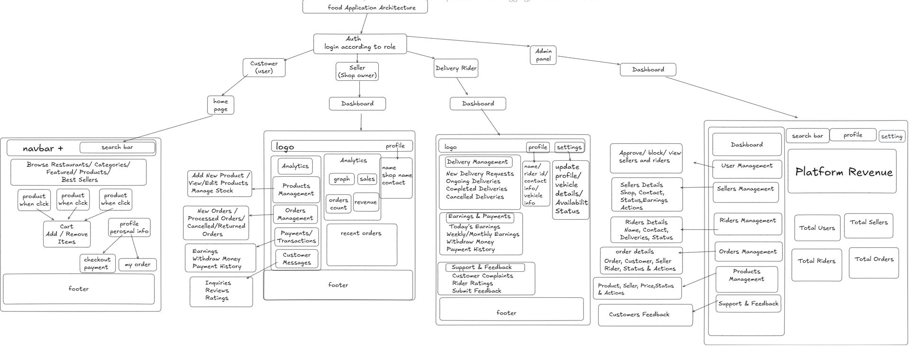

## App Architecture



## MERN Backend

This project now includes a Node/Express backend using MongoDB, JWT authentication, and Joi validation. The server lives in the `server/` directory.

### Getting started

1. Copy `.env.example` to `.env` inside `server/` and fill in your MongoDB URI and JWT secret.
2. Install dependencies in both client and server:
   ```sh
   cd server && npm install
   cd .. && npm install
   ```
3. Start both services concurrently:
   ```sh
   npm run dev
   ```
   *The `dev` script uses `concurrently` to run the server and the Vite client.*

4. API endpoints are prefixed with `/api` and proxying is configured in `vite.config.js` (you can override the base URL with `VITE_API_URL` in a `.env` file if needed).


### New Features

- **User model extended**: sellers now supply `restaurantName` and `restaurantAddress` during signup. These fields are stored and returned in the JWT payload.
- **Products stored in MongoDB** instead of local assets. Sellers can CRUD their own items via the `/api/products` endpoints using their JWT token.
- **Restaurants endpoints**:
  - `GET /api/restaurants` returns all seller accounts (restaurants).
  - `GET /api/restaurants/:id/products` lists products for a specific restaurant.
- **Client updates**: the store context now fetches products from the backend, and a new `RestaurantList` component displays available restaurants on the home page. Clicking a restaurant opens a menu page showing its items.

Use Postman or your front-end UI to create sellers and products; the database will persist them.

Feel free to extend the backend with additional routes and models as needed.
